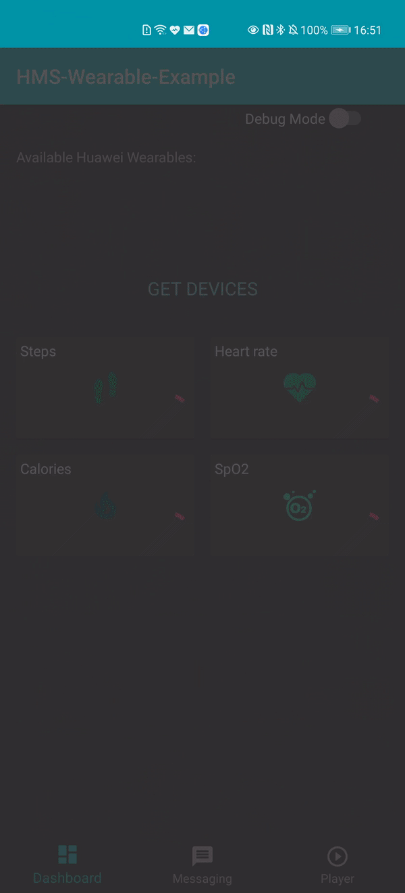
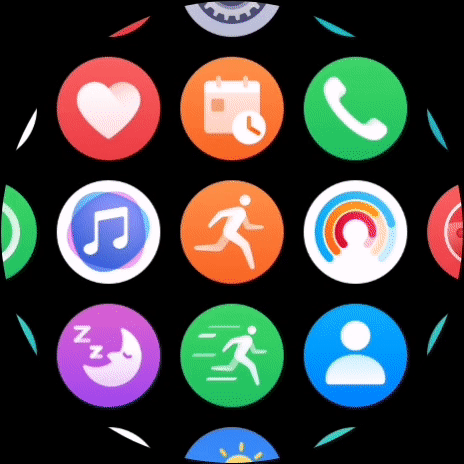
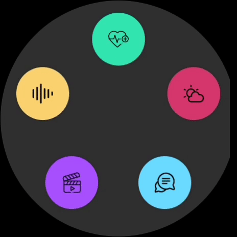
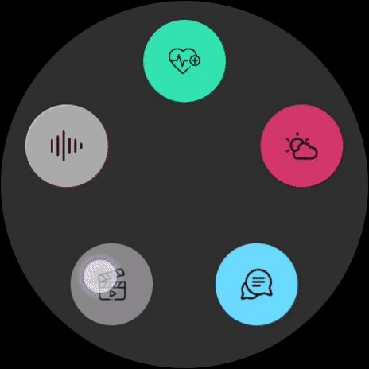
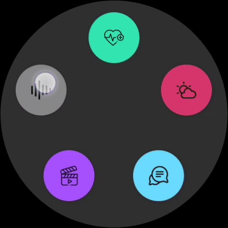

# HarmonyOS-Playground :watch: :hearts: :iphone:

A `Companion & Standalone` HarmonyOS app that interacts with an Android device (GMS & HMS).

[This is the link] to the Android project (phone app) which interacts with this Harmony OS project.

## Table of Contents

- [Setup](#setup)
- [Demo](#demo)
- [Pending Features](#pending_features)
- [Libraries Used](#libraries_used)
- [License](#license)

## Setup
1. Apply for Wear Engine (just for companion apps)

In order to be able to communicate with an Android device which integrates the WearEngine SDK for this `companion` use case, it will be necessary to apply from the Huawei Developer console, more info here: [wearengine-application]

2. Apply for Health Kit

In order to be able to communicate with Huawei Health and get any available tracked data, it's necessary to apply from the Huawei Developer console, more info here: [healthkit-application]
Likewise if the feature involves watch sensors connection and retrieve `Real Time Data`, then Health Kit online application is required.

3. Debug & Release Signing Config (mandatory for companion apps)

It's necessary to add the specific values for the next entries in the `local.properties`:
* **debugStoreFile**
* **debugStorePassword**
* **debugKeyAlias**
* **debugKeyPassword**
* **debugSignAlg**
* **debugProfile** 
* **debugCertPath**  
(likewise for the release)

## Demo

<table>Health with Ping(to wake up the watch app)<tr>
<td></td>
<td></td>
</tr></table> 

<table>Messaging: photo sending (from phone to watch) and text message (from watch to phone)<tr>
<td></td>
<td></td>
</tr></table> 

<table>Video Player: video control from the watch<tr>
<td></td>
<td></td>
</tr></table> 

<table>Audio: record, play radio stations, local files and recorded files<tr>
<td>
 
</td>
</tr></table> 

## Pending Features

- Add a module for the Circle Menu
- Add Dependency Injection
- Add VMs factory and inject VMs
- Verify Sensors data (Real Time Data)
- Add Weather API and remove Jokes API
- Add Unit tests for the data layer at least
- ~~Update Readme~~ 

## Libraries Used

* [WearEngine][0] for companion sync with an Android device (GMS&HMS).
* [GSON][1] for Java Objects conversion into their JSON representation.
* [RxJava][2] for reactive style programming (from VM to Data). 
* [Retrofit][3] for REST api communication. 
* [Timber][4] for logs output.  

[0]:  https://developer.huawei.com/consumer/en/doc/development/connectivity-Guides/integrating-phone-sdk-0000001051137958
[1]:  https://github.com/google/gson
[2]:  https://github.com/ReactiveX/RxAndroid
[3]:  https://github.com/square/retrofit
[4]:  https://github.com/JakeWharton/timber

## License

    Copyright 2021 Fernando Prieto Moyano

    Licensed under the Apache License, Version 2.0 (the "License");
    you may not use this file except in compliance with the License.
    You may obtain a copy of the License at

       http://www.apache.org/licenses/LICENSE-2.0

    Unless required by applicable law or agreed to in writing, software
    distributed under the License is distributed on an "AS IS" BASIS,
    WITHOUT WARRANTIES OR CONDITIONS OF ANY KIND, either express or implied.
    See the License for the specific language governing permissions and
    limitations under the License.

[This is the link]: https://github.com/ferPrieto/HMS-Wearable-Example
[healthkit-application]: https://developer.huawei.com/consumer/en/doc/development/HMSCore-Guides/apply-kitservice-0000001050071707
[wearengine-application]: https://developer.huawei.com/consumer/en/doc/development/connectivity-Guides/applying-wearengine-0000001050777982